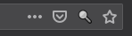
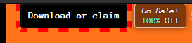

# Itch.io Scroll To Buy/Claim Button

Adds a page action to itch.io to scroll to the buy button.

Click the button to jump to the next buy/claim button. Clicking multiple times cycles through the buttons (e.g. Contribute Now, then top buy/claim button, then bottom buy/claim botton).

The button is [scrolled into view](https://developer.mozilla.org/en-US/docs/Web/API/Element/scrollIntoView) which means to the top of the window (if the page has neough vertical followup space). The button is highlighted with a red, dashed outline.

## Developer References

* [manifest.json/page_action](https://developer.mozilla.org/en-US/docs/Mozilla/Add-ons/WebExtensions/manifest.json/page_action)
* [JS pageAction](https://developer.mozilla.org/en-US/docs/Mozilla/Add-ons/WebExtensions/API/pageAction)
